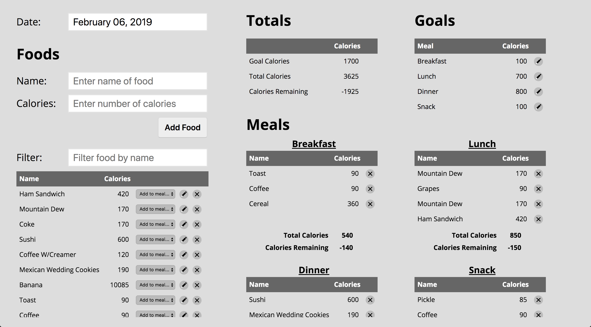

# Quantified Self Front-End

[Production Server Link](https://ryan-mcneil.github.io/quantified-self-fe/)

[Agile Project Management Board](https://github.com/ryan-mcneil/quantified-self-be/projects/1)

Quantified Self is an application that allows users to track calorie intake.  Foods and their corresponding calories are added to a database via a simple input form.  Foods can then be added to any of four defined meals: breakfast, lunch, dinner and snack.  Consumed calories are summarized by meal and day.

Users are also able to add daily and meal goals, helping them track progress throughout the day.  In addition to subtotals for calories consumed for each meal, remaining calories are also displayed based on the goals entered for that meal. Daily total calories consumed, the user's daily goal, and their difference are displayed and updated as foods are added to meals throughout the day.



## Initial Setup

1. Clone this repository:

  ```shell
  git clone https://github.com/ryan-mcneil/quantified-self-fe.git
  ```
2. Change into the `quantified-self-fe` directory

  ```shell
  cd quantified-self-fe
  ```


3. Install the project dependencies:

  ```shell
  npm install
  ```

## Running the Server Locally

To see your code in action locally, you need to fire up a development server. Use the command:

```shell
npm start
```

Once the server is running, visit in your browser:

* `http://localhost:8080/` to run your application.

## Built With

* [JavaScript](https://www.javascript.com/)
* [jQuery](https://jquery.com/)

## Contributors

[Ryan McNeil](https://github.com/ryan-mcneil)

[Michael Gatewood](https://github.com/mngatewood)

## Known Issues

* Front-end application requires tests
* Application needs to be further styled to be responsive and mobile-friendly
* Production site fails to load favicon
* It may not be immediately clear to the user that the calories listed for each meal under "Goals" is the goal that was set on the date the meals were created.  When the user edits these goals, the goals table is updated and future meals will be created with the updated goals.  However, it may be confusing for the user if they notice the "calories remaining" for each meal do not update because this field is based on the goal established on that date.
